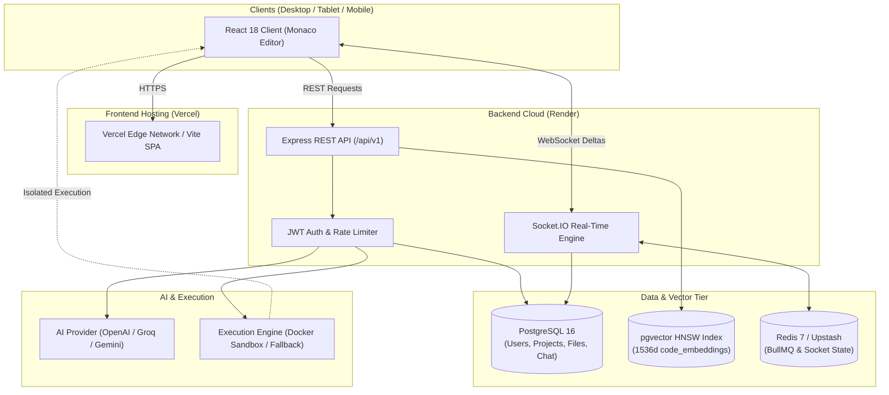

# CodeSync AI

> AI-powered real-time collaborative cloud code editor with project-aware RAG assistance and sandboxed execution.

[](https://www.typescriptlang.org/)
[](https://react.dev/)
[](https://nodejs.org/)
[](https://socket.io/)
[](https://github.com/pgvector/pgvector)
[](LICENSE)

---

## 1. Documentation & Technical Specifications

Comprehensive technical reports, architectural designs, security audits, and deployment guides are available in the [`docs/`](docs/) directory:

| Document | Description |
| :--- | :--- |
| **[FINAL_TECHNICAL_REPORT.md](docs/FINAL_TECHNICAL_REPORT.md)** | Authoritative technical specification: database schemas, REST APIs, Socket.IO protocols, RAG pipeline, and container sandbox. |
| **[PROJECT_REPORT.md](docs/PROJECT_REPORT.md)** | Comprehensive project overview, architectural trade-offs, benchmarks, and performance metrics. |
| **[UI_DESIGN.md](docs/UI_DESIGN.md)** | VS Code Dark Modern design tokens, color palette, responsive breakpoints, and Monaco Editor integration. |
| **[DEPLOYMENT.md](docs/DEPLOYMENT.md)** | Step-by-step production deployment instructions for Vercel, Render, Supabase, Neon, and Docker. |
| **[SECURITY.md](docs/SECURITY.md)** | Security threat modeling, container isolation, JWT rotation, rate limiting, and vulnerability reporting. |
| **[ENVIRONMENT.md](docs/ENVIRONMENT.md)** | Complete environment variable specifications and secret management contracts across workspaces. |
| **[Agent.md](docs/Agent.md)** | Autonomous AI pair programmer guardrails, implementation phase order, and testing protocols. |

---

## 2. Overview

**CodeSync AI** is a real-time collaborative cloud development environment designed for distributed engineering teams, pair programmers, technical interviewers, and educators. 

Traditional online code editors either lack multi-file workspaces, isolate developers without real-time synchronization, or provide generic AI chatbots that lack awareness of the broader repository. CodeSync AI solves this by integrating:

1. **Sub-50ms Delta Collaboration**: Low-bandwidth Monaco Editor delta broadcasts with collaborative multi-user cursors and in-room chat.
2. **Project-Aware RAG (Retrieval-Augmented Generation)**: PostgreSQL `pgvector` HNSW vector search to ground AI answers in the active repository code with exact file and line citations.
3. **Isolated Sandboxed Execution**: Secure, resource-bounded code compilation and execution with strict time and memory limits.
4. **Adaptive Multi-Device Interface**: A VS Code-inspired dark interface built with responsive breakpoints for Desktop, Tablet, and Mobile devices.

---

## 3. Features

### Real-Time Collaboration
* **Monaco Delta Synchronization**: Broadcasts character-level deltas (`range`, `rangeOffset`, `text`, `versionId`) without sending full file text or triggering echo loops.
* **Room-Based Collaboration**: Ephemeral collaboration rooms identified by 8-character Room IDs.
* **Remote Cursor Presence**: Multi-user cursor tracking with dynamic 6-color user tags.
* **Collaborative In-Room Chat**: Integrated project chat persisted to PostgreSQL with message deletion and history retrieval.

### Cloud IDE & Code Editor
* **Monaco Editor Core**: Powered by `@monaco-editor/react` with VS Code Dark Modern theme tokens (`#181818`, `#1e1e1e`, `#1f1f1f`, `#007acc`) and JetBrains Mono ligatures.
* **Hierarchical File Explorer**: Infinite-depth directory trees with inline file/folder creation, renaming, and cascading deletion.
* **Multi-Tab Workspace**: Tab management with dirty-state indicators and active file tracking.
* **Adaptive Breakpoint Layout**: Specialized layouts for Desktop (`≥1200px`), Tablet (`768px–1199px`), and Mobile (`<768px`) with slide-over drawers and touch-optimized navigation.

### AI Assistant & Pair Programmer
* **Automated Code Review**: Returns structured JSON security audits, performance suggestions, and suggested fixes with line ranges.
* **Intelligent Debugging**: Identifies root causes, explains runtime exceptions, and generates corrected code.
* **Code Explanation**: Analyzes algorithms, structural components, and asymptotic time/space complexities.
* **Streaming AI Chat**: Real-time markdown streaming via Server-Sent Events (SSE) compatible with OpenAI, Groq, and Google Gemini API endpoints.

### Project-Aware RAG Pipeline
* **Language-Aware Chunking**: Chunks source code into ~500-token blocks with an 80-token overlap, preserving function and class boundaries.
* **Vector Embeddings**: 1536-dimensional vector generation conforming to OpenAI's `text-embedding-3-small`.
* **HNSW Cosine Similarity Search**: Sub-10ms vector retrieval backed by PostgreSQL `pgvector` indexing.
* **Project Context Grounding**: Enforces strict `project_id` tenant isolation so embeddings never leak between projects, returning cited sources with similarity scores.

### Sandboxed Code Execution
* **Multi-Language Runner**: Supports Python, JavaScript, TypeScript, C, and C++.
* **Hard Resource Limits**: 5000ms execution timeout (`SIGKILL`), 128MB RAM, 50% CPU core quota, and 64KB stdout/stderr buffer ceiling.
* **Interactive Standard Input**: Supports interactive `stdin` piping for competitive programming and console prompts.
* **Dual Execution Mode**: Docker container runner (`codesync-sandbox`) with fallback to local subprocess isolation.

### Authentication & Storage
* **Dual-Token JWT Security**: 15-minute access tokens and 7-day refresh tokens with automatic client rotation.
* **Bcrypt Password Hashing**: Salted password hashing (10 rounds).
* **Two-Tier Storage**: Active source files stored directly in PostgreSQL (`files.content TEXT`), with S3 configured for backup snapshots.

---

## 4. UI Layout & Demo

The CodeSync AI interface reflects the VS Code Dark Modern design language:

```text
┌────────────────────────────────────────────────────────────────────────┐
│ [≡] </> CodeSync  [Project: test2 ⌵]  [▶ Run]        [✨ AI] [Room: ABCD]│ Top Bar (40px)
├──────┬────────────────────────────────────┬────────────────────────────┤
│ [📁] │ EXPLORER     │ main.py ×           │ AI ASSISTANT               │
│ [🔍] │ ▾ src        │─────────────────────│ ┌────────────────────────┐ │
│ [👥] │   main.py    │ 1 def solve():      │ │ 💡 Review: Line 14     │ │
│ [⚙️] │   utils.py   │ 2     print("Hello")│ │ Use parameterized SQL  │ │
│      │   README.md  │  3                  │ └────────────────────────┘ │
│      │              │                     │ 💬 "Explain this function" │
├──────┴──────────────┴─────────────────────┴────────────────────────────┤
│ OUTPUT  TERMINAL  CHAT [2]                                             │ Bottom Dock
│ Output: Hello                                                          │ (Collapsible)
├────────────────────────────────────────────────────────────────────────┤
│ 🔗 main*                                       Python  👥 2 Connected  │ Status Bar (24px)
└────────────────────────────────────────────────────────────────────────┘
```

* **Live Demo**: Deployable to Vercel (Frontend) and Render (Backend). See [DEPLOYMENT.md](docs/DEPLOYMENT.md).
* **Design Specifications**: Full design tokens and UI mockups are detailed in [UI_DESIGN.md](docs/UI_DESIGN.md).

---

## 5. Tech Stack

| Layer | Technologies | Description |
| :--- | :--- | :--- |
| **Frontend** | React 18, TypeScript, Vite | Single Page Application with fast HMR |
| **Editor** | Monaco Editor (`@monaco-editor/react`) | Code editor with syntax highlighting and diff editing |
| **Styling** | Tailwind CSS, Lucide Icons | VS Code Dark Modern theme tokens and responsive layouts |
| **State Management** | Zustand | Lightweight client stores (`useUIStore`, `useProjectStore`, `useAuthStore`) |
| **Backend API** | Node.js 20 LTS, Express 4.19 | Modular REST API routing with Zod validation |
| **Real-Time** | Socket.IO 4.8 | Low-latency WebSockets with fallback to HTTP long-polling |
| **Database** | PostgreSQL 16 (`pg` Pool) | Relational database with cascading integrity |
| **Vector Search** | pgvector 0.7+ | 1536-dimensional HNSW cosine distance vector index |
| **Task Queue** | Redis 7, BullMQ | Asynchronous job queues and real-time buffering |
| **AI Providers** | OpenAI SDK (OpenAI, Groq, Gemini) | Multi-provider LLM inference and embeddings |
| **Code Execution** | Docker, Dockerode | Alpine Linux sandboxes with isolated namespaces |
| **Security** | Helmet, express-rate-limit, bcryptjs | Security headers, IP rate limiting, and dual JWT rotation |
| **Deployment** | Vercel (Client), Render (API) | Cloud edge static hosting and managed web services |

---

## 6. System Architecture



For the complete architectural specification, database schemas, and data flow models, refer to **[FINAL_TECHNICAL_REPORT.md](docs/FINAL_TECHNICAL_REPORT.md)**.

---

## 7. RAG Architecture

The project-aware Retrieval-Augmented Generation (RAG) pipeline allows the embedded AI assistant to answer codebase questions with precise file and line citations.

```text
Active Repository Files
         │
         ▼
[Language-Aware Recursive Chunker]
  • ~500 tokens per chunk with 80-token overlap
  • Preserves function, class, and comment blocks
         │
         ▼
[Embedding Generation Engine]
  • OpenAI text-embedding-3-small (1536 dimensions)
  • Deterministic fallback for offline / mock testing
         │
         ▼
[PostgreSQL pgvector Storage]
  • Persisted in `code_embeddings` table
  • Indexed with Hierarchical Navigable Small World (HNSW)
         │
         ▼
[Cosine Distance Similarity Search]
  • WHERE project_id = $1 (Strict Tenant Isolation)
  • Sub-10ms query: ORDER BY embedding <=> $2::vector ASC LIMIT 5
         │
         ▼
[Grounded Prompt Assembly & Model Generation]
  • Injects retrieved file paths, line ranges, and code blocks
  • Streams response with file/line accordion citations
```

---

## 8. Project Structure

```text
CodeSync-AI/
├── docs/                     # Project documentation, architecture specs, and guides
│   ├── Agent.md              # Autonomous agent guidelines & roadmap
│   ├── DEPLOYMENT.md         # Production deployment guide (Vercel, Render, Supabase)
│   ├── ENVIRONMENT.md        # Environment variables & secrets specification
│   ├── FINAL_TECHNICAL_REPORT.md # Technical specification & architecture report
│   ├── PROJECT_REPORT.md     # Comprehensive project report & benchmarks
│   ├── SECURITY.md           # Security audit & threat model
│   └── UI_DESIGN.md          # VS Code Dark Modern design tokens & layout
├── .env.example              # Central environment configuration contract
├── docker-compose.yml        # Local development infrastructure (Postgres, Redis, MinIO)
├── docker-compose.prod.yml   # Production multi-container composition
├── package.json              # Monorepo root workspace configuration
│
├── client/                   # REACT 18 + VITE FRONTEND
│   ├── src/
│   │   ├── api/              # Fetch API client and AI streaming endpoints
│   │   ├── components/       # Monaco editor, file tree, activity bar, AI panel, dock
│   │   ├── hooks/            # useSocket, useDebounce, useAuth hooks
│   │   ├── sockets/          # socketClient instance and connection lifecycle
│   │   ├── store/            # Zustand stores (UI, Project, Editor, Auth)
│   │   └── types/            # TypeScript interfaces
│   ├── tailwind.config.js    # VS Code Dark Modern theme tokens
│   ├── vercel.json           # Vercel SPA routing and caching rules
│   └── vite.config.ts        # Vite build and development proxy settings
│
├── server/                   # NODE.JS + EXPRESS + SOCKET.IO BACKEND
│   ├── src/
│   │   ├── config/           # Database pool, Redis, and OpenAI SDK client
│   │   ├── controllers/      # Auth, Project, File, AI, Execution, RAG controllers
│   │   ├── db/               # PostgreSQL pool, schema.sql, and migrate.ts runner
│   │   ├── middlewares/      # JWT auth, rate limiter, validation, error handler
│   │   ├── routes/           # REST endpoints (/api/v1/*)
│   │   ├── services/         # Execution sandbox, AI reasoning, RAG vector search
│   │   ├── sockets/          # Socket.IO handlers for deltas, cursors, chat
│   │   └── utils/            # JWT signing, code chunker, custom ApiError
│   ├── Dockerfile            # Multi-stage production container definition
│   └── tsconfig.json
│
├── worker/                   # BULLMQ ASYNCHRONOUS TASK WORKER
│   ├── src/
│   │   ├── index.ts          # Worker runner listening on 'code-execution' queue
│   │   └── jobs/             # Code execution background processing
│   ├── Dockerfile            # Production worker container definition
│   └── package.json
│
└── docker-runtimes/          # SANDBOX EXECUTION IMAGES
    └── Dockerfile.sandbox    # Alpine Linux with Python 3.11, Node 20, GCC 13, OpenJDK 17
```

---

## 9. Environment Variables

Environment variables are partitioned cleanly across workspaces. Template contracts are provided in `.env.example` files. Never commit actual `.env` files containing credentials. For complete variable descriptions and production secret guidelines, see **[ENVIRONMENT.md](docs/ENVIRONMENT.md)**.

### Backend Server (`server/.env`)
```env
PORT=5000
NODE_ENV=development
CLIENT_URL=http://localhost:5173
DATABASE_URL=postgresql://postgres:[PASSWORD]@[HOST]:5432/postgres
REDIS_URL=redis://localhost:6379
JWT_ACCESS_SECRET=super_secret_access_key_min_32_characters
JWT_REFRESH_SECRET=super_secret_refresh_key_min_32_characters
JWT_ACCESS_EXPIRES_IN=15m
JWT_REFRESH_EXPIRES_IN=7d
OPENAI_API_KEY=sk-proj-...
# OPENAI_BASE_URL=https://api.groq.com/openai/v1   # Optional alternative
# OPENAI_MODEL=openai/gpt-oss-120b                 # Optional alternative
```

### Frontend Client (`client/.env`)
```env
VITE_API_URL=http://localhost:5000/api/v1
VITE_SOCKET_URL=http://localhost:5000
```

### Background Worker (`worker/.env`)
```env
NODE_ENV=development
REDIS_URL=redis://localhost:6379
DATABASE_URL=postgresql://postgres:[PASSWORD]@[HOST]:5432/postgres
OPENAI_API_KEY=sk-proj-...
DOCKER_SOCKET_PATH=//./pipe/docker_engine
WORKER_CONCURRENCY=5
```

---

## 10. Local Development Setup

### 1. Prerequisites
* **Node.js**: v20 LTS or higher
* **npm**: v10 or higher
* **PostgreSQL**: v16 with `pgvector` extension enabled (Local Docker or Supabase/Neon cloud instance)
* **Redis**: v7 (Optional for local mode, required for BullMQ worker)

### 2. Installation
Clone the repository and install root workspace dependencies:
```bash
git clone https://github.com/Niranjan05Kumar/CodeSync-AI.git
cd CodeSync-AI
npm install
```

### 3. Setup Environment Files
```bash
cp server/.env.example server/.env
cp client/.env.example client/.env
cp worker/.env.example worker/.env
```
Update `server/.env` with your PostgreSQL database credentials and AI API key.

### 4. Execute Database Migrations
```bash
npm run db:migrate
```

### 5. Launch Development Servers
Open two terminal windows:

```bash
# Terminal 1: Start Backend API & Socket.IO (Port 5000)
npm run dev:server

# Terminal 2: Start Frontend Client (Port 5173)
npm run dev:client
```
Open `http://localhost:5173` in your browser.

---

## 11. Database & pgvector Setup

CodeSync AI requires PostgreSQL 16 with the `uuid-ossp` and `vector` extensions.

### Manual SQL Extension Initialization
```sql
CREATE EXTENSION IF NOT EXISTS "uuid-ossp";
CREATE EXTENSION IF NOT EXISTS "vector";
```

### Running Automated Migrations
The migration runner (`server/src/db/migrate.ts`) idempotently applies tables, constraints, cascades, and vector indexes:
```bash
npm --prefix server run db:migrate
```

### Verifying Database & pgvector
Verify database health and vector distance queries:
```bash
npm --prefix server run db:test
```

---

## 12. Docker Setup & Sandboxing

CodeSync AI uses Docker containers to run user-submitted code in an isolated environment.

### Security Boundaries
* **Network Isolation**: Containers run with `--network none` to prevent data exfiltration, socket connections, and cloud metadata access (`169.254.169.254`).
* **Resource Restrictions**: Memory capped at `128MB`, CPU quota capped at `50%` of a single core.
* **Process Table Limits**: PIDs limit of `64` to neutralize fork-bombs (`:(){ :|:& };:`).
* **Ephemeral Filesystem**: Root filesystem is `--read-only`, mounting transient scratchpads on `--tmpfs /tmp:rw,noexec,nosuid,size=16m`.
* **Unprivileged User**: Processes run as `sandboxuser` (`UID 10001:10001`).
* **Hard Wall-Clock Timeout**: A 5000ms timer sends `SIGKILL` (exit code 137) to stop infinite loops.

> **Security Notice**: Docker containerization provides educational and development-level isolation. For enterprise-grade untrusted multi-tenant execution, deploying **gVisor (runsc)** or **AWS Firecracker microVMs** is recommended.

---

## 13. API Documentation

All REST routes are versioned under `/api/v1` and return standardized JSON envelopes.

| Method | Endpoint | Description | Auth Required |
| :--- | :--- | :--- | :--- |
| `GET` | `/health` | Cloud platform health check | No |
| `GET` | `/api/v1/health` | API & database connectivity check | No |
| `POST` | `/api/v1/auth/register` | Register new user account | No |
| `POST` | `/api/v1/auth/login` | Authenticate user & issue tokens | No |
| `POST` | `/api/v1/auth/refresh` | Rotate access token using refresh token | No |
| `GET` | `/api/v1/auth/me` | Fetch active user profile | **Yes** |
| `POST` | `/api/v1/projects` | Create a new project workspace | **Yes** |
| `GET` | `/api/v1/projects` | List all projects belonging to user | **Yes** |
| `GET` | `/api/v1/projects/:id` | Fetch project details by ID | **Yes** |
| `DELETE`| `/api/v1/projects/:id` | Delete project and cascade all files | **Yes** |
| `POST` | `/api/v1/projects/join` | Join room via 8-character Room ID | **Yes** |
| `GET` | `/api/v1/projects/:id/tree` | Retrieve full file explorer hierarchy | **Yes** |
| `POST` | `/api/v1/projects/:id/files`| Create new file or directory | **Yes** |
| `PUT` | `/api/v1/projects/:id/files/:fileId` | Update file content and increment version | **Yes** |
| `POST` | `/api/v1/execute` | Run source code in sandboxed runner | **Yes** |
| `POST` | `/api/v1/ai/review` | Run structured static code review | **Yes** |
| `POST` | `/api/v1/ai/debug` | Identify root causes and generate fixes | **Yes** |
| `POST` | `/api/v1/ai/explain`| Generate code explanation and complexity | **Yes** |
| `POST` | `/api/v1/ai/chat` | Multi-turn streaming AI assistant chat | **Yes** |
| `POST` | `/api/v1/rag/sync` | Chunk and index repository into pgvector | **Yes** |
| `POST` | `/api/v1/rag/query` | Grounded question answering with citations | **Yes** |

---

## 14. Socket.IO Real-Time Protocols

Real-time collaboration runs over Socket.IO with JWT handshake authentication (`auth: { token: 'Bearer ...' }`).

| Direction | Event Name | Payload | Purpose |
| :--- | :--- | :--- | :--- |
| **Client → Server** | `room:join` | `{ projectId }` | Joins collaboration room |
| **Server → Client** | `room:joined` | `{ projectId, assignedColor, members, pastMessages }` | Confirms room membership & loads chat history |
| **Server → Client** | `room:user_joined` | `{ user: { id, username, color } }` | Broadcasts new peer presence |
| **Server → Client** | `room:user_left` | `{ userId }` | Broadcasts peer disconnection |
| **Client → Server** | `editor:change` | `{ projectId, fileId, changes: MonacoChange[], version }` | Sends Monaco character-level deltas |
| **Server → Client** | `editor:change` | `{ fileId, changes, senderId, version }` | Broadcasts deltas to peers (`socket.to`) |
| **Client → Server** | `cursor:move` | `{ projectId, fileId, position: { lineNumber, column } }` | Sends local cursor position |
| **Server → Client** | `cursor:update` | `{ userId, username, color, position, fileId }` | Updates remote collaborator cursor flags |
| **Client → Server** | `chat:send` | `{ projectId, message }` | Sends collaborative room chat message |
| **Server → Client** | `chat:message` | `{ id, userId, username, color, message, createdAt }` | Broadcasts chat message to room |
| **Client → Server** | `chat:clear` | `{ projectId }` | Clears room chat history |
| **Server → Client** | `execution:result` | `{ jobId, userId, result }` | Broadcasts code execution completion |

---

## 15. Production Deployment

CodeSync AI is structured for deployment across modern cloud platforms:

* **Frontend Client → [Vercel](https://vercel.com)**:
  * Framework: Vite
  * Root Directory: `client`
  * Build Command: `npm run build`
  * Output Directory: `dist`
  * Environment Variables: `VITE_API_URL`, `VITE_SOCKET_URL`
* **Backend API & WebSockets → [Render](https://render.com)**:
  * Runtime: Node.js 20 Web Service
  * Root Directory: `server`
  * Build Command: `npm ci && npm run build`
  * Start Command: `npm run start`
  * Health Check Endpoint: `/health`
* **Database → [Supabase](https://supabase.com) or [Neon](https://neon.tech)**: PostgreSQL 16 with `pgvector`
* **Cache & Queues → [Upstash](https://upstash.com)**: Serverless Redis with TLS

For step-by-step deployment instructions, refer to **[DEPLOYMENT.md](docs/DEPLOYMENT.md)**.

---

## 16. Security Hardening

CodeSync AI implements multiple defense layers:

* **Fail-Fast Production Startup**: In `NODE_ENV=production`, the backend verifies that `JWT_ACCESS_SECRET` and `JWT_REFRESH_SECRET` are at least 32 characters and halts if placeholder secrets are detected.
* **CORS Lockdown**: Production Socket.IO and Express CORS restrict access exclusively to `CLIENT_URL`.
* **Rate Limiting**: Configured with `express-rate-limit`:
  * Global API Limiter: 100 requests per 15 minutes per IP.
  * Compute & AI Limiter: 20 requests per minute per IP for `/execute`, `/ai/*`, and `/rag/*`.
* **SQL Injection Prevention**: All queries in `server/src/db/pool.ts` use parameterized queries (`$1, $2, ...`).
* **Production Error Masking**: Unhandled server exceptions mask internal stack traces and database credentials, returning generic `"Internal server error"` to end users while logging details on the server.
* **Security Headers**: Managed via Helmet (`nosniff`, `SAMEORIGIN`, `cross-origin` resource policy).

For the full security audit, refer to **[SECURITY.md](docs/SECURITY.md)**.

---

## 17. Automated Testing Suite

The repository includes end-to-end integration and verification suites:

```bash
# Verify PostgreSQL connectivity, pgvector extension, and HNSW cosine search
npm --prefix server run db:test

# Run Phase 2 REST API & authentication suite (32/32 tests)
npm --prefix server run test:api

# Run Phase 5 Real-time Socket.IO collaboration suite (15/15 tests)
npm --prefix server run test:sockets

# Run Phase 6 Sandboxed execution & timeout suite (13/13 tests)
npm --prefix server run test:exec

# Run Phase 7 AI Assistant review, debug, and streaming chat suite (21/21 tests)
npm --prefix server run test:ai

# Run Phase 8 Project-Aware RAG vector retrieval suite (19/19 tests)
npm --prefix server run test:rag

# Run Phase 9 Production security hardening suite (24/24 tests)
npm --prefix server run test:hardening

# Type-check all workspaces
npm run type-check

# Production build test
npm --prefix client run build
npm --prefix server run build
npm --prefix worker run build
```

---

## 18. Future Roadmap

* **CRDT Integration**: Migrate from delta broadcasts to Conflict-free Replicated Data Types (Yjs or Automerge) for enhanced offline-first conflict resolution.
* **Multi-Server Redis Adapter**: Deploy `@socket.io/redis-adapter` for horizontal scaling across multi-instance server clusters.
* **gVisor / Firecracker Sandboxes**: Replace standard container isolation with microVM-based execution for untrusted multi-tenant workloads.
* **Multi-File Execution**: Support complex build configurations (CMake, cargo, npm build) within cloud execution containers.
* **Git Version History**: Native Git staging, diff viewer, and commit integration within the web workspace.

---

## 19. Author & License

* **Project**: CodeSync AI
* **Author**: Niranjan Kumar ([@Niranjan05Kumar](https://github.com/Niranjan05Kumar)) & CodeSync AI Team
* **License**: [MIT License](LICENSE)
